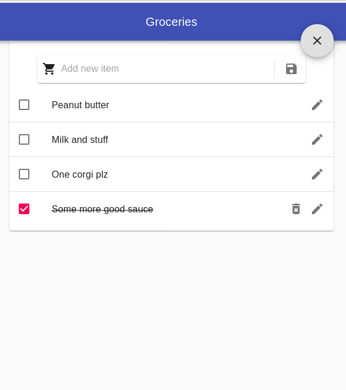

# Groceria

Plain and simple self-hostable groceries web app, built with react and typescript. 

## Goals
- SPA with literally only one page, no separate lists, just the list for groceries
- No separate users

## Development
- Requirements: Yarn, Node 14+, Python 3.8+, Poetry 
- Install frontend with `yarn install`, run with `yarn start:ui`
- Install backend (inside `server` folder) with `poetry install`, run (from root) with `yarn run start:server`
- Linting & formatting:
  - Frontend: `yarn lint:ui`, or `yarn lint:ui:fix` to fix errors. Runs prettier, eslint + some other checks.
  - Backend: `yarn lint:server`, or `yarn lint:server:fix` to fix errors. Runs black.

## Self-hosted installation
- Clone this git repo
- Install app and run with Docker:
  - e.g. `docker build . -t groceria && docker run -it -p 80:8000 groceria`
- Uvicorn python server shouldn't be served without proxy in front, so I'll suggest you to add traefik, nginx or whatever you prefer to your setup.
  - See `docker-compose.yml` as an example how to serve app behing traefik
- All items are saved to `db.json` file inside app root in container. You can mount it with `-v $(pwd)/db.json:/app/db.json` when running.

## Licence
MIT
